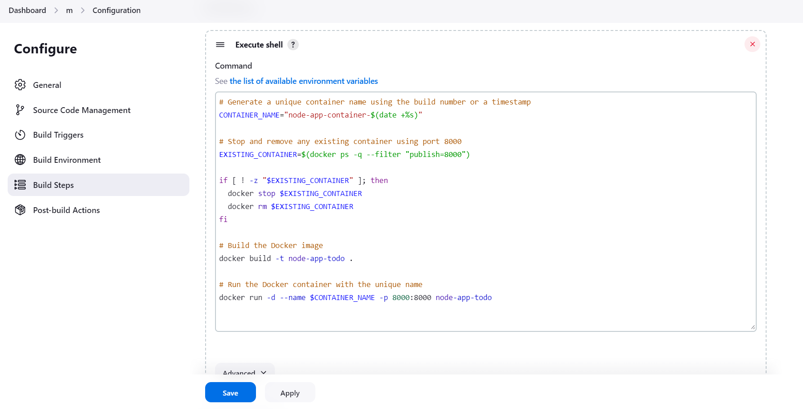
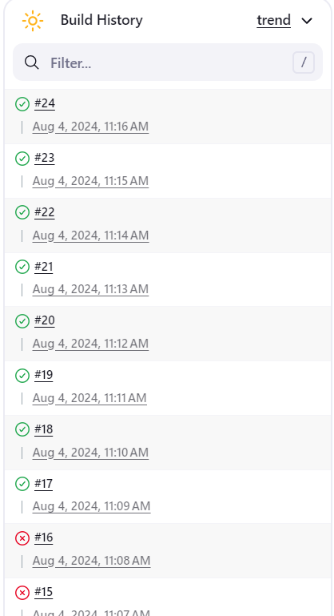
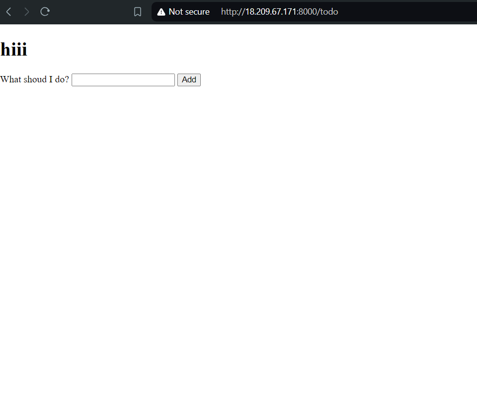
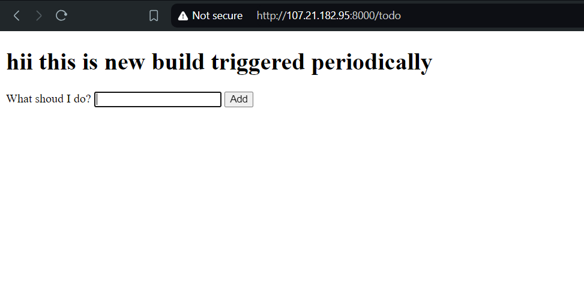

## Overview
This project demonstrates a complete DevOps pipeline using Jenkins and Docker for a Node.js application. The focus is on implementing continuous integration and continuous deployment (CI/CD) to automate the build, test, and deployment processes.

## Features
- Automated build and deployment using Jenkins
- Containerized application using Docker
- Scheduled builds every 5 minutes
- Deployment on Amazon EC2 (Ubuntu)

## Technology Stack
- **CI/CD**: Jenkins
- **Containerization**: Docker
- **Cloud Provider**: Amazon EC2
- **Version Control**: GitHub
- **Application**: Node.js


## Installation and Setup

### Step 1: Launch an Amazon EC2 Instance
1. Launch an Ubuntu 20.04 LTS instance on AWS.
2. Ensure the security group allows SSH (port 22), HTTP (port 80), and custom TCP rule for your application (port 8000).

### Step 2: Set Up Docker on EC2
1. SSH into your EC2 instance.
2. Install Docker:
    ```bash
    sudo apt update
    sudo apt install docker.io -y
    sudo systemctl start docker
    sudo systemctl enable docker
    sudo usermod -aG docker ${USER}
    ```
### Step 3: Jenkins Setup
1. Install Jenkins:
    ```bash
    sudo wget -O /usr/share/keyrings/jenkins-keyring.asc \
    https://pkg.jenkins.io/debian-stable/jenkins.io-2023.key
    echo "deb [signed-by=/usr/share/keyrings/jenkins-keyring.asc]" \
    https://pkg.jenkins.io/debian-stable binary/ | sudo tee \
    /etc/apt/sources.list.d/jenkins.list > /dev/null
    sudo apt-get update
    sudo apt-get install jenkins
    sudo systemctl start jenkins
    sudo systemctl enable jenkins
    ```
2. Access Jenkins via `http://<your-ec2-public-ip>:8080` and complete the setup.

### Step 4: Jenkins Pipeline Configuration
1. Create a new Jenkins job.
2. Configure the job to pull the repository from GitHub.
3. Add build steps to:
    - Build the Docker image.
    - Run the Docker container.

4. Schedule the build to run every 5 minutes or desired time.



### Step 4: Docker Setup
1. Build the Docker image:
    ```bash
    docker build -t node-app-todo .
    ```
2. Run the Docker container:
    ```bash
    docker run -d --name node-app-container -p 8000:8000 node-app-todo
    ```

## Accessing the Application
- Access the running application via `http://<your-ec2-public-ip>:8000`.





